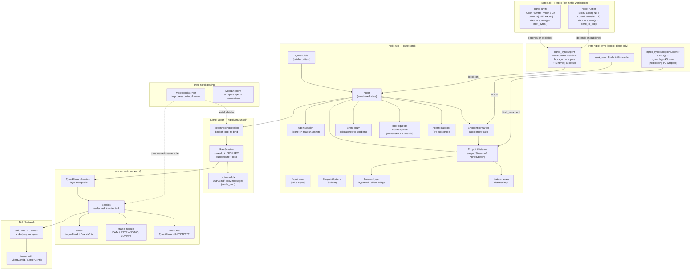
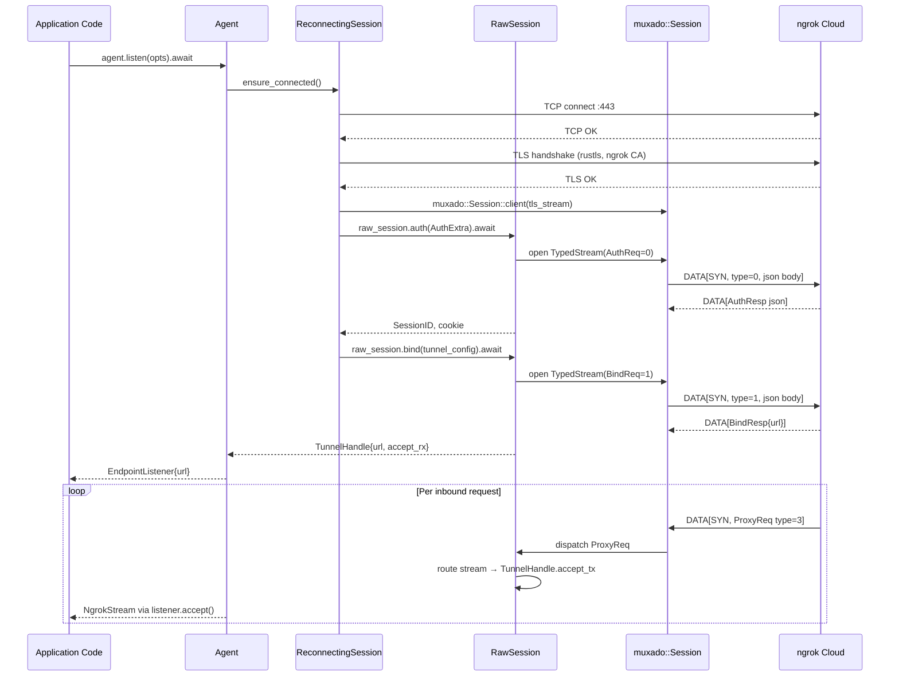
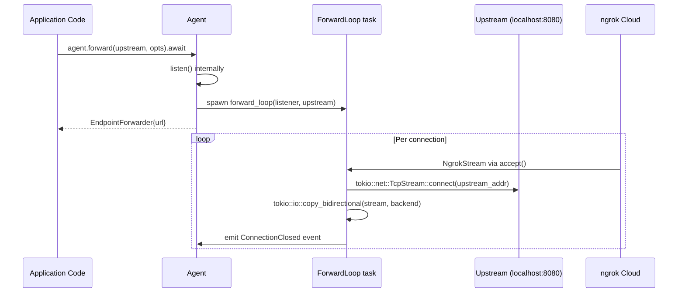
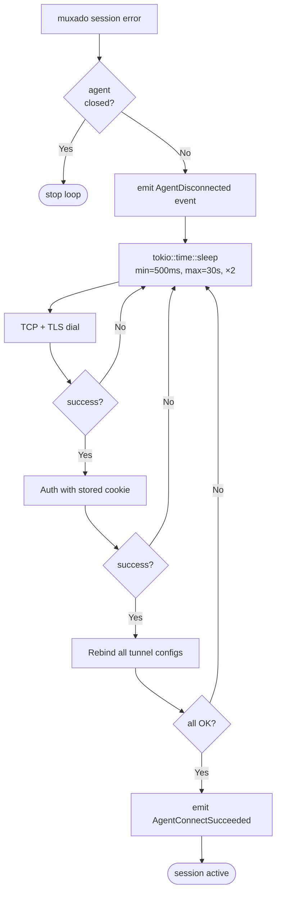

# Architecture — `ngrok-rust`

## Component Map



---

## Layers

| Layer | Crate/Module | Responsibility |
|-------|-------------|----------------|
| **Public API** | `ngrok::` root | `Agent`, `EndpointListener`, `EndpointForwarder`, events, options |
| **Integration** | `ngrok::integrations::hyper` / `axum` | Feature-gated trait impls |
| **Tunnel Client** | `ngrok::tunnel::reconnecting` | Reconnect loop, re-bind, backoff |
| **Raw Session** | `ngrok::tunnel::raw_session` | Auth/Bind/Proxy over typed muxado streams |
| **Wire Protocol** | `ngrok::proto` | `Auth`, `Bind`, `Proxy`, `StopTunnel` serde structs |
| **Muxado** | `muxado` (crate) | Full muxado protocol: frames, sessions, streams, heartbeat |
| **TLS / Transport** | `tokio-rustls` + `rustls` | TLS over TCP; `aws-lc-rs` feature for FIPS backend |
| **Blocking API** | `ngrok-sync` | **Control plane only**: owns `tokio::Runtime`; `block_on` wrappers for connect/listen/bind; exposes `runtime()` for data-plane task spawning |
| **Test Helpers** | `ngrok-testing` | In-process mock ngrok server; no authtoken needed |
| **FFI Adapters** | external repos | `ngrok-uniffi`, `ngrok-rustler`, etc. — control plane via `ngrok-sync`; data plane via `rt.spawn()` + `NgrokStream::next_bytes()` |

---

## Control Plane vs Data Plane

This is the most important architectural boundary in the FFI story. Every operation in
the library falls into exactly one plane:

| Plane | Examples | Frequency | `block_on` ok? | Mechanism |
|-------|----------|-----------|---------------|-----------|
| **Control** | connect, auth, listen, bind, close, config | Low (once per session/endpoint) | ✅ Yes | `ngrok-sync` wrappers |
| **Data** | read stream bytes, write stream bytes | High (every packet) | ❌ No — starves host runtime | `rt.spawn()` + `next_bytes()` |

### FFI Adapter Data-Plane Flow

```mermaid
sequenceDiagram
    participant HL as Host Language Thread<br/>(Elixir scheduler / libuv / etc.)
    participant NS as ngrok_sync::Agent
    participant RT as tokio::Runtime
    participant ST as ngrok::NgrokStream

    HL->>NS: agent.listen(opts)         [block_on — control plane ✅]
    NS-->>HL: EndpointListener

    HL->>NS: listener.accept()          [block_on — control plane ✅]
    NS-->>HL: ngrok::NgrokStream

    HL->>RT: rt.spawn(async move {      [returns immediately ✅]
        loop {
            bytes = stream.next_bytes().await
            host_send(bytes)            [zero-copy arc bump]
        }
    })
    RT-->>HL: JoinHandle (dropped)

    Note over HL: Host thread unblocked immediately
    Note over RT,ST: Tokio drives data plane independently
    RT->>ST: next_bytes().await
    ST-->>RT: Some(bytes::Bytes)
    RT->>HL: host_send(bytes)           [async message / callback]
```

The key insight: `listener.accept()` is a one-time `block_on` (acceptable — it waits for
a connection to arrive, analogous to `TcpListener::accept()`). The stream I/O loop is
entirely within the Tokio runtime; the host thread is never blocked on network data.

### `NgrokStream::next_bytes()` — Zero-Copy Frame Extraction

The muxado layer internally buffers incoming `DataFrame` payloads as `bytes::Bytes` arcs
pointing into the TLS receive window. `next_bytes()` clones (arc-bumps) this `Bytes`
handle and returns it, allowing FFI adapters to wrap the memory in the host language's
native byte type without a deep copy:

```
muxado recv buffer   →  bytes::Bytes (arc)  →  ErlNifBinary (Elixir, zero-copy if pinned)
                     →  bytes::Bytes (arc)  →  napi Buffer  (Node.js, zero-copy)
                     →  bytes::Bytes (arc)  →  Span<byte>   (C#, unsafe pin)
```

---

## Key Data Flows

### Listen Mode: Full Connection Path



### Forward Mode: Proxy Loop



### Reconnection Flow



---

## Module Structure

```
muxado/src/                            ← crate: muxado
├── lib.rs                     ← re-exports all public types: Session, SessionConfig,
│                                 SessionTermination, Stream, StreamId, TypedStreamSession,
│                                 TypedStream, Heartbeat, HeartbeatConfig, MuxadoError,
│                                 ErrorCode, frame module
├── session.rs                 ← Session: reader task + writer task + stream_map
├── session_config.rs          ← SessionConfig: window size, accept backlog, queue depth
├── stream.rs                  ← Stream: AsyncRead + AsyncWrite
├── stream_id.rs               ← StreamId newtype, parity helpers
├── stream_map.rs              ← StreamId → StreamInner registry (internal)
├── window.rs                  ← outbound flow-control window (Semaphore-based, internal)
├── buffer.rs                  ← inbound receive buffer (VecDeque + Notify, internal)
├── typed.rs                   ← TypedStreamSession, TypedStream
├── heartbeat.rs               ← Heartbeat, HeartbeatConfig
├── error.rs                   ← MuxadoError enum, ErrorCode enum
└── frame/
    ├── mod.rs                 ← Frame enum, read_frame / write_frame, re-exports
    ├── header.rs              ← 8-byte header: length (24b) | type (4b) | flags (4b) | stream_id (32b)
    ├── data.rs                ← DataFrame (SYN / FIN flags)
    ├── rst.rs                 ← RstFrame (ErrorCode u32)
    ├── wndinc.rs              ← WndIncFrame (window increment u32)
    └── goaway.rs              ← GoAwayFrame (last_stream_id + error_code + debug)

ngrok/src/                             ← crate: ngrok
├── lib.rs                     ← re-exports, package-level listen/forward helpers
├── agent.rs                   ← AgentBuilder, Agent, AgentState (Arc<Mutex<>>)
├── session.rs                 ← AgentSession
├── endpoint.rs                ← EndpointInfo, EndpointKind, shared metadata
├── listener.rs                ← EndpointListener, NgrokStream, NgrokAddr
├── forwarder.rs               ← EndpointForwarder, forward_loop task
├── upstream.rs                ← Upstream value object, ProxyProtoVersion enum
├── options.rs                 ← EndpointOptions, EndpointOptionsBuilder
├── events.rs                  ← Event enum, all event structs
├── error.rs                   ← Error, DiagnoseError (thiserror)
├── rpc.rs                     ← RpcRequest, RpcMethod, RpcResponse
├── diagnose.rs                ← Agent::diagnose, DiagnoseResult
├── defaults.rs                ← package-level listen/forward using env authtoken
├── proto/
│   ├── mod.rs
│   └── msg.rs                 ← Auth, AuthExtra, BindReq, BindResp, ProxyHeader,
│                                 StopTunnel, SrvInfoResp  (serde::Deserialize/Serialize)
├── tunnel/
│   ├── mod.rs
│   ├── raw_session.rs         ← RawSession: Auth, Bind, accept proxy streams
│   │                            (uses muxado::TypedStreamSession + Heartbeat)
│   └── reconnecting.rs        ← ReconnectingSession: dial loop + backoff + rebind
└── integrations/
    ├── mod.rs
    ├── hyper.rs               ← feature = "hyper": TokioIo bridge usage note
    └── axum.rs                ← feature = "axum": axum::serve::Listener impl

ngrok-testing/src/                     ← crate: ngrok-testing
├── lib.rs                     ← re-exports
├── server.rs                  ← MockNgrokServer (in-process, tokio::io::duplex)
│                                (uses muxado::Session::server() directly)
├── endpoint.rs                ← MockEndpoint (inject / accept test connections)
└── fixtures.rs                ← test certificates, sample traffic policies

ngrok-sync/src/                        ← crate: ngrok-sync
├── lib.rs                     ← re-exports; package-level blocking listen/forward
├── agent.rs                   ← Agent (blocking); owns tokio::Runtime; exposes runtime()
├── listener.rs                ← EndpointListener (blocking); accept() → ngrok::NgrokStream
└── forwarder.rs               ← EndpointForwarder (blocking)
# No stream.rs — NgrokStream is ngrok::NgrokStream; data plane is FFI adapter's responsibility

# FFI adapter crates live in their own external repositories:
#
#   ngrok-uniffi/   (e.g. github.com/ngrok/ngrok-uniffi)
#   ├── src/lib.rs  ← #[uniffi::export] on ngrok-sync control plane
#   │               ← rt.spawn() + next_bytes() for data plane
#   └── ngrok.udl   ← UniFFI definition file
#
#   ngrok-rustler/  (lives inside the Elixir package, e.g. native/ngrok_rustler/)
#   └── src/lib.rs  ← #[rustler::nif] on ngrok-sync control plane
#                   ← rt.spawn() + send_to_pid() for data plane
```

---

## Concurrency & State

| Component | Ownership / Sync Primitive | Notes |
|-----------|--------------------------|-------|
| `Agent` | `Arc<AgentInner>` | Cheaply cloneable handle |
| `AgentInner.state` | `tokio::sync::RwLock<AgentState>` | State machine: Created / Connecting / Connected / Disconnecting |
| `AgentInner.endpoints` | `tokio::sync::RwLock<Vec<EndpointHandle>>` | Snapshot-copy on `endpoints()` |
| `AgentInner.event_handlers` | `Vec<Box<dyn Fn(Event)+Send+Sync>>` | Written once at build time; read-only during operation |
| `ReconnectingSession` | `Arc<ReconnectInner>` | Shared between Agent and reconnect task |
| `muxado::Session` | `Arc<SessionInner>` | Reader task + writer task both hold Arc |
| `muxado::StreamMap` | `std::sync::RwLock<HashMap<StreamId, StreamInner>>` | Fine-grained: locked only for insert/remove |
| `muxado::Stream.inbound` | `Mutex<VecDeque<Bytes>> + Notify` | `AsyncRead` wakes blocked readers |
| `muxado::Stream.window` | `tokio::sync::Semaphore` | `AsyncWrite` acquires permits; `WNDINC` adds them |
| `EndpointListener.accept_rx` | `tokio::sync::mpsc::Receiver<NgrokStream>` | One receiver per endpoint |

Thread safety: all public types are `Send + Sync`. The library is safe to use from
multiple tokio tasks simultaneously.

---

## Extension Points

| Extension | How |
|-----------|-----|
| Custom TLS backend | Pass `rustls::ClientConfig` to `AgentBuilder::tls_config`; enable `aws-lc-rs` feature for FIPS |
| Custom TCP dialer | Not directly exposed on `AgentBuilder` in v1; planned via `tower::Service` layer |
| Upstream TLS | `Upstream::tls_config(rustls::ClientConfig)` |
| Event monitoring | `AgentBuilder::on_event(handler)` |
| RPC handling | `AgentBuilder::on_rpc(handler)` |
| Test transport | `ngrok_testing::MockNgrokServer` — replaces the real cloud endpoint; uses `muxado::Session::server()` directly |
| Custom muxado framing | Import `muxado::frame` module for frame-level access (advanced) |
| Cross-language control plane (UniFFI) | Add `ngrok-uniffi` in its own repo; annotate `ngrok-sync` types with `#[uniffi::export]` |
| Cross-language control plane (Rustler) | Add Rust NIF code inside the Elixir package; annotate `ngrok-sync` types with `#[rustler::nif]` |
| Cross-language data plane (any target) | Call `agent.runtime()` to get `Arc<Runtime>`; `rt.spawn(async { stream.next_bytes().await })` per connection |
| Any other FFI target | Create a new adapter crate; depend on `ngrok-sync` for control plane; use `next_bytes()` for data plane |
